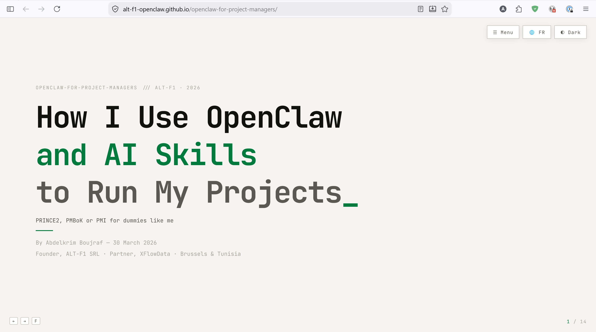

# How I Use OpenClaw and AI Skills to Run My Projects

**PRINCE2, PMBoK or PMI for dummies like me**

*By Abdelkrim Boujraf — 30 March 2026*

## 🌐 Browse the Presentation

**Available in 3 languages: English, French, Dutch**

[](https://alt-f1-openclaw.github.io/openclaw-for-project-managers/en/)

- 🇬🇧 **English:** [/en/](https://alt-f1-openclaw.github.io/openclaw-for-project-managers/en/)
- 🇫🇷 **Français:** [/fr/](https://alt-f1-openclaw.github.io/openclaw-for-project-managers/fr/)
- 🇳🇱 **Nederlands:** [/nl/](https://alt-f1-openclaw.github.io/openclaw-for-project-managers/nl/)

Or clone and open `en/index.html` locally in any browser.

## What is this?

A 14-slide interactive presentation showing how [OpenClaw](https://openclaw.ai) and custom AI Skills turn project management from tedious clicking into natural language conversations.

- 📸 Snap a whiteboard → structured Gantt chart
- 💬 Talk to your PM tool via Discord
- 🔧 OpenProject, Jira, HubSpot — all through conversation
- ⚡ Set up a full project in 45 minutes instead of 4-5 hours

## Features

- **14 interactive slides** — terminal aesthetic with JetBrains Mono
- **3 languages** — English, French, Dutch (dropdown selector)
- **Dark/light theme** toggle
- **Keyboard, click, and touch** navigation
- **Slide menu** for quick jumping
- **JSON-based i18n** — translations in separate `lang/*.json` files

## Navigation

- **Arrow keys** or **Space** — next/previous slide
- **Click** left/right halves of the screen
- **Swipe** on touch devices
- **F** for fullscreen
- **☰ Menu** button for slide overview
- **🌐 Dropdown** for language switching

## Architecture

```
index.html              → redirects to /en/
en/index.html           → English slides (loads lang/en.json)
fr/index.html           → French slides (loads lang/fr.json)
nl/index.html           → Dutch slides (loads lang/nl.json)
lang/en.json            → 131 translation keys (English)
lang/fr.json            → 131 translation keys (French)
lang/nl.json            → 131 translation keys (Dutch)
template.html           → shared HTML template (source)
generate.py             → generates en/fr/nl from template + JSON
assets/                 → images, favicon
```

One HTML template, three JSON translation files. The slide engine detects the language from the URL path and loads the corresponding JSON via `fetch()`.

## Links mentioned in the presentation

### OpenClaw

- **OpenClaw**: [openclaw.ai](https://openclaw.ai) — open-source, self-hosted Personal AI Assistant
- **ClawHub**: [clawhub.ai](https://clawhub.ai) — browse and install skills
- **Community**: [Discord](https://discord.com/invite/clawd) — OpenClaw Discord server
- **Source**: [github.com/openclaw/openclaw](https://github.com/openclaw/openclaw) — OpenClaw source code

### ALT-F1 Skills on GitHub

- **OpenProject** — work packages, projects, time entries, comments, attachments via API v3
  [github.com/ALT-F1-OpenClaw/openclaw-skill-openproject](https://github.com/ALT-F1-OpenClaw/openclaw-skill-openproject)
  [clawhub.ai/abdelkrim/openproject-by-altf1be](https://clawhub.ai/abdelkrim/openproject-by-altf1be)

- **Jira Cloud** — issues, comments, attachments, workflows, JQL search via REST API v3
  [github.com/ALT-F1-OpenClaw/openclaw-skill-atlassian-jira-by-altf1be](https://github.com/ALT-F1-OpenClaw/openclaw-skill-atlassian-jira-by-altf1be)

- **HubSpot** — CRM, CMS, Marketing, Conversations, Automation
  [github.com/ALT-F1-OpenClaw/openclaw-skill-hubspot-by-altf1be](https://github.com/ALT-F1-OpenClaw/openclaw-skill-hubspot-by-altf1be)

- **SharePoint** — file ops & Office document intelligence via Graph API
  [github.com/ALT-F1-OpenClaw/openclaw-skill-sharepoint](https://github.com/ALT-F1-OpenClaw/openclaw-skill-sharepoint)

- **X/Twitter** — tweets, threads, media via X API v2
  [github.com/ALT-F1-OpenClaw/openclaw-skill-x-twitter](https://github.com/ALT-F1-OpenClaw/openclaw-skill-x-twitter)

- **M365 Task Manager** — Microsoft 365 To Do & Planner
  [github.com/ALT-F1-OpenClaw/openclaw-skill-m365-task-manager](https://github.com/ALT-F1-OpenClaw/openclaw-skill-m365-task-manager)

- **Skill Template** — template for creating new OpenClaw skills
  [github.com/ALT-F1-OpenClaw/openclaw-skill-template](https://github.com/ALT-F1-OpenClaw/openclaw-skill-template)

### Tools & Services Referenced

- [OpenProject](https://www.openproject.org) — open source project management
- [Atlassian Jira](https://www.atlassian.com/software/jira) — issue & project tracking
- [Mistral AI OCR](https://mistral.ai/news/mistral-ocr-3) — document processing
- [NLTK](https://www.nltk.org/) — Natural Language Toolkit (Python)
- [Rasa](https://rasa.com/) — open source ML framework
- [LUIS](https://luis.azure.us/) — Microsoft Language Understanding
- [Mattermost](https://github.com/mattermost/mattermost) — open source messaging
- [XFlowdata](https://www.xflowdata.com)
- [OpenClaw User Group Belgium](https://www.meetup.com/openclaw-user-group-belgium/events) — Meetup

### Author

- [Abdelkrim Boujraf](https://be.linkedin.com/in/abdelkrimboujraf) — LinkedIn
- [ALT-F1 SRL](https://www.alt-f1.be) — Brussels
- [XFlowData](https://xflowdata.com) — Partner

## Inspired by

Design pattern from [last-line.dev](https://github.com/mmaudet/last-line.dev) by [Michel-Marie Maudet](https://github.com/mmaudet), [Linagora](https://linagora.com).

## License

[AGPL-3.0](LICENSE)
